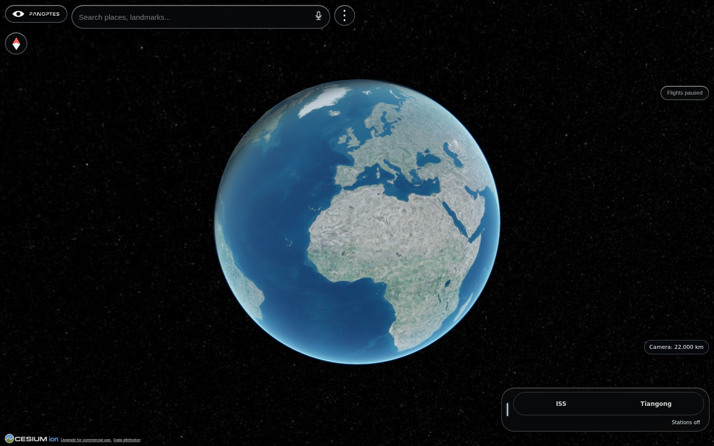
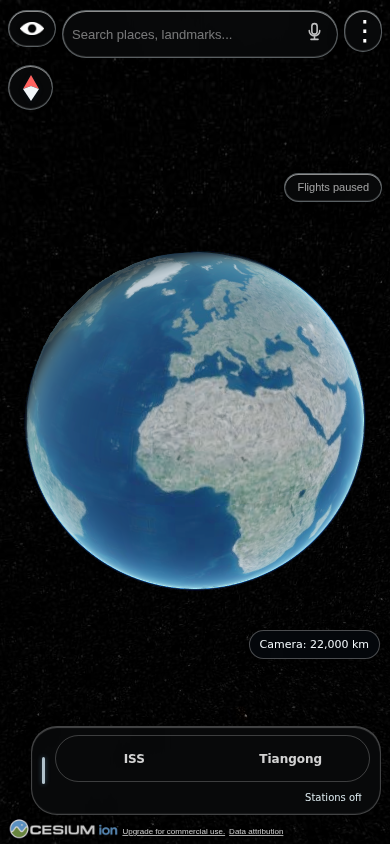
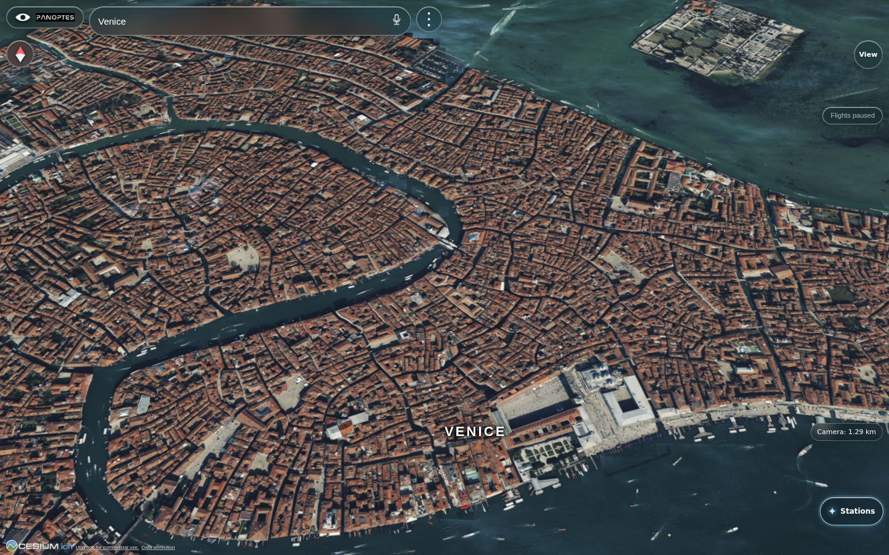
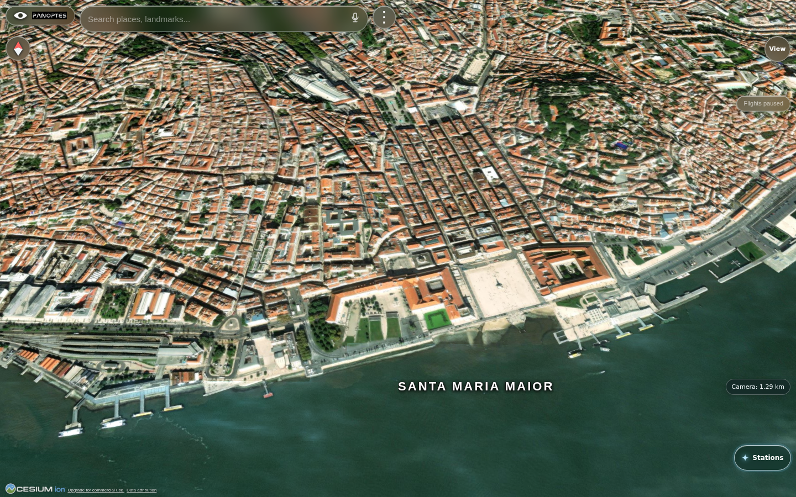
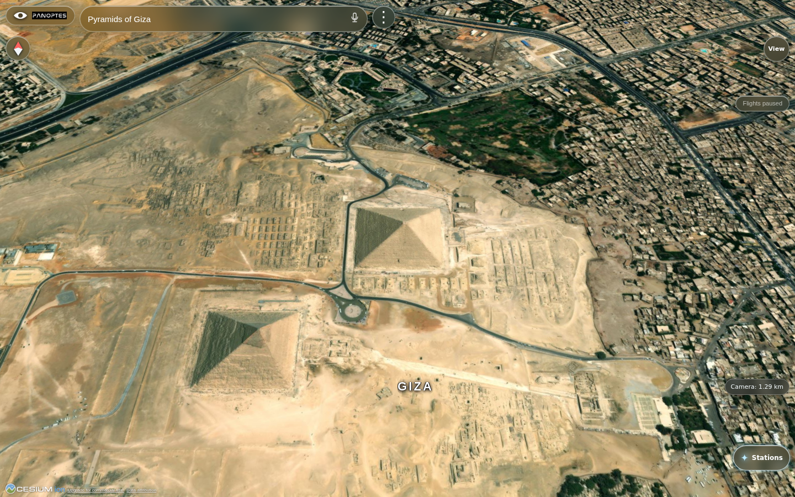

# PANOPTES

An original mobile-browser Earth explorer by Paarth Jawalkar. PANOPTES uses CesiumJS, Cesium ion terrain and Bing aerial imagery, with Wikipedia/Wikidata and OpenStreetMap-based search.

## Status

The `main` branch records numbered development snapshots. v27.0.27b is the current public BASIC build; v24-v26 were development previews, and some earlier previews still need Android testing. Live flights are paused. Photorealistic 3D landmark data is not enabled while a safe free-tier cutoff is unresolved. Extreme polar imagery gaps and device performance remain under investigation. Do not use this app for navigation.

The history was recreated from saved release archives. Credential strings in all revisions were replaced with placeholders. Bundled Cesium library files were removed in favor of CDN links. To run locally, replace `REPLACE_WITH_YOUR_CESIUM_ION_TOKEN` in `app.js` with your own token outside a public commit, then serve the directory from a static web server. Do not commit credential-bearing copies or archives. External data-provider terms apply.

## Screenshots

Public BASIC v27.0.27b, captured in a desktop browser and a 390 × 844 mobile-sized browser viewport. The mobile capture is not a physical-device or FPS test. Aerial imagery and terrain are provided through Cesium ion; these are views of the app, not original photographs or photorealistic landmark models. Flights are paused in these captures.

| Desktop globe | Mobile-sized globe |
|:---:|:---:|
|  |  |

| Venice canals | Lisbon waterfront | Giza pyramids |
|:---:|:---:|:---:|
|  |  |  |

## Feedback

Ideas and bug reports are welcome through GitHub Issues. Please include your device, browser, steps to reproduce, and a screenshot when useful. We'll review suggestions there.

## Data and library credits

- [CesiumJS](https://cesium.com/learn/cesiumjs/) for the globe renderer; Cesium ion for terrain, imagery delivery and OSM Buildings. CesiumJS is Apache-2.0 licensed; datasets have separate terms.
- [Bing Maps](https://www.microsoft.com/en-us/maps/bing-maps/product) aerial imagery through Cesium ion.
- [OpenStreetMap](https://www.openstreetmap.org/copyright) contributors and [Nominatim](https://nominatim.org/) for geographic data and search.
- [Wikipedia](https://www.wikipedia.org/) and [Wikidata](https://www.wikidata.org/) for landmark search.
- [Nasalization](https://www.typodermicfonts.com/nasalization/) by Typodermic Fonts for the supplied static wordmark image. Rights to the image/font are not granted by this repository.

The original PANOPTES application code is available under the PolyForm Noncommercial License 1.0.0. You may copy, modify, run, and share it for permitted noncommercial purposes if you keep the license and this credit. Commercial use is not permitted without a separate license from Paarth Jawalkar. The software is provided as is, without warranty or liability to the extent the law allows. Third-party libraries, imagery, terrain, building data, models, and fonts retain their own licenses and are not relicensed by us.
